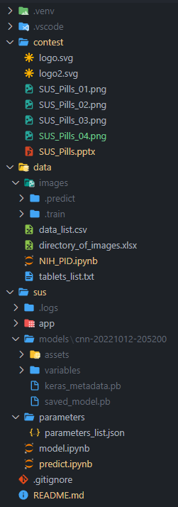

<p align="center">
  
</p>

# SUS Pills
A project designed for the AI4Youth contest by students from ZS Rataje: Mikołaj P., Maurycy L., Maciej K. under the guardianship of Rafał Sz.

## Instructions
In order to run the project from the beginning:
1. Ensure that you are using the **3.9.12** Python version (preferably in some kind of environment).
2. Go to the `./data/NIH_PID.ipynb` file:
   - (Optional) Beforehand, open the `./data/directory_of_images.xlsx` file and copy all the desired pill names from the **Name** column to the `./data/tablets_list.txt` file, without any other characters between lines.
   - Follow all the instructions included in the `./data/NIH_PID.ipynb` file and run all the cells afterwards. The downloaded images are uncropped.
3. Go to the `./sus/model.ipynb` file, follow its instructions, and run all the cells afterwards.
4. Go to the `./sus/predict.ipynb` file, follow its instructions, and run all the cells afterwards.

With the prepared material you can also skip all of that by doing this single step:
- Go to the `./sus/predict.ipynb` file, follow its instructions, and run all the cells afterwards.

## Tree
```
SUS_Pills
├───contest
├───data
│   └───images
│       ├───.predict
│       └───.train
└───sus
    ├───app
    ├───models
    │   └───cnn-20221012-205200
    └───parameters
```
From top to bottom we have:
- `SUS_Pills` - root folder with the `README.md` file and every other folder.
- `contest` - folder with the required documentation for the project.
- `data` - folder with data and data-oriented files.
- `images` - folder with every image folder like `.predict` and `.train`.
- `.train` - folder used for training. It contains folder named after types of pille, in which are corresponding pill photos.
- `.predict` - folder with all pill photos used for prediction.
- `sus` - main folder where the AI model is created and you can predict the pills. The HTML app is also included, but it is mostly unfinished.
- `app` - folder containing all the app files.
- `models` - folder where all models are saved.
- `cnn-20221012-205200` - folder with the current best model.
- `parameters` - folder with the parameters forthe model.

There is also a graphic representation of the tree, including the directories automatically created by the environment (look for more in the **Environment specifications**):
<p align="center">
    
</p>

## Implemented functions
- Mostly-automatic directory creation.
- Automatic data collection/download.
- Model creation with multiple parameters sets.
- Pill type prediciton.
- Graphical interface (HTML page).

## Environment specifications
- Python version used: 3.9.12
- Virual environment created with the `python -m venv "path"` command.
- There are no outside dependencies that cannot be downloaded with the `pip install` command. Consequently, all the downloaded libraries (e.g. Tensorflow or Numpy) should not conflict with each other, as all of them are downloaded from the same python build.
- The project was originally created as a private github repository, in the VSCode, thus on the graphical tree you can see `.gitignore` file and `.vscode` folder. Of course, these are not necessary to run any of the scripts in the project.

## Credits
- Logo design - Mikołaj P.
- Work screenshots - Mikołaj P.
- Presentation - Mikołaj P.
- Data search - Mikołaj P.
- `NIH_PID.ipynb` and associated files - Mikołaj P.
- `model.ipynb` and associated files - Mikołaj P.
- `predict.ipynb` and associated files - Mikołaj P.
- `README.md` and associated files - Mikołaj P.
- App folder and associated files - Maurycy L., Maciej K.

## Copyright information
Most of the training data comes from [this link](https://lhncbc.nlm.nih.gov/project/c3pi-computational-photography-project-pill-identification) and [this link](https://data.lhncbc.nlm.nih.gov/public/Pills/index.html).
Our logo uses the font from [this link](https://www.1001fonts.com/timeburner-font.html).
